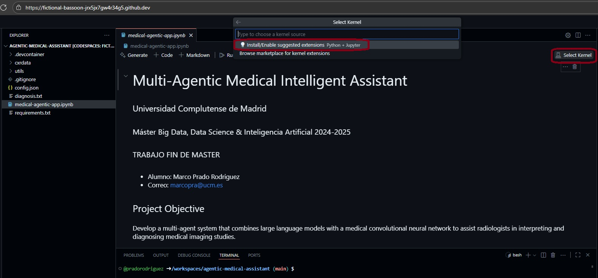
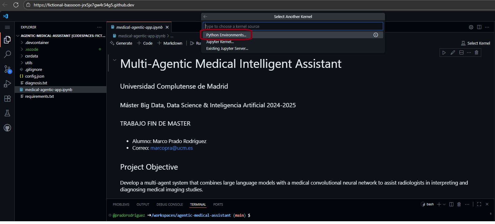
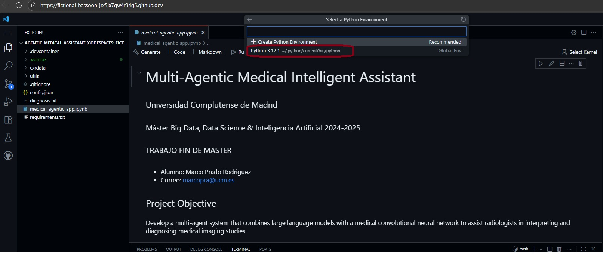

# Getting Started with this course

This page describe the required steps to run the **medical-agentic-app.ipynb** notebook.

## Setup Steps

To execute this code, you will need to complete the following steps.

### Configure your working environment

**Github Codespaces** will automatically open the Visual Studio Code online version, with the cloned repository and ready to execute the code from this workshop.

The python jupyter notebook will execute the notebook calling models hosted in Azure, specifically Azure AI Foundry and Azure Machine Learning.

The authentication against Azure is done using connectivity variables hosted as **GitHub CodeSpaces Secrets**.

#### Create a Github Codespaces environment

On the main page of this repo, go to: **Code** -> **Codespaces** tab -> **Create codespace on main**.

> [!NOTE]
> This step will automatically open a new browser explorer tab with an online version of Visual Studio Code. This will be your CodeSpaces environment.

### Configure the CodeSpaces VSCode environment

* **To run the Jupyter Notebook**, inside Github Codespaces Visual Studio Code, select the app **medical-agentic-app.ipynb** file in the **root** folder
* Click **Select Kernel** (at top right of the jupyter notebook) 
* Select **Install/Enable suggested extensions Python + Jupyter** option shown.

* Click the **Python Environments** option (at top middle of the jupyter notebook)

* Click the **Python 3.12.1** option (at top middle of the jupyter notebook)

* You can now **Run** each action (piece of code) or **Run All** to execute the whole notebook.

## ALTERNATIVE OPTION TO CODESPACES VISUAL STUDIO CODE: JupyterLab

* An alternative to using CodeSpaces Visual Studio Code is CodeSpaces JupyterLab.
* With the CodeSpaces environment created.
* Close the newly opened browser tab with Online Visual Studio Code.
* On the main page of this repo, go to: **Code** -> **Codespaces** tab -> click the **elipsis (...)** buttom (next to the CodeSpaces environment name) -> click **Open in JupyterLab**.

## Let's Get Started

The code and demo is located in the **[medical-agentic-app.ipynb](../medical-agentic-app.ipynb) notebook**

> [!IMPORTANT]  
> You must request to Marco Prado via email (pradorodriguez@outlook.com and marcopra@ucm.es) to turn on the Azure environment so you can properly call the model endpoints. Specify the **time** and **date** when the notebook will be executed.